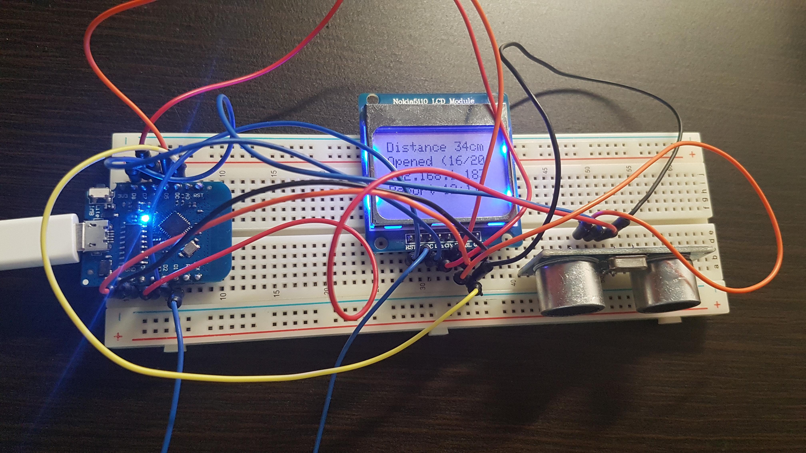

# Garage Door Checker

Application reports garage door open/closed. It is based on [Wemos D1 mini lite](https://wiki.wemos.cc/products:d1:d1_mini_lite) and [Ultrasonic Sensor HC-SR04](https://randomnerdtutorials.com/complete-guide-for-ultrasonic-sensor-hc-sr04/) and optional [Nokia 5110 LCD display](https://github.com/adafruit/Adafruit-PCD8544-Nokia-5110-LCD-library).

It is reported via [IFTTT](https://ifttt.com) to whatever endpoint.

## Development environment

After basic start with ~~[Arduino IDE](https://www.arduino.cc/en/main/software)~~ I've switched to absolutely fantastic combination of [VSCode](https://code.visualstudio.com/) with [PlatformIO](https://platformio.org/). __It's so cool!__ It is a really pleasure to 

There are several libraries used in project, most of them imported via PlatformIO, some are included in the project, as some changes had to be done.

- [NewPing for ESP8266](https://github.com/jshaw/NewPingESP8266), I believe it's a modification of [Teckel's implementation](https://bitbucket.org/teckel12/arduino-new-ping/downloads).
- [PCD8544 - Nokia 5110 LCD](https://github.com/adafruit/Adafruit-PCD8544-Nokia-5110-LCD-library) - there is a [merge request](https://github.com/adafruit/Adafruit-PCD8544-Nokia-5110-LCD-library/pull/35) - the code included in the project is with the changes taken from merge request.

## Hardware 
